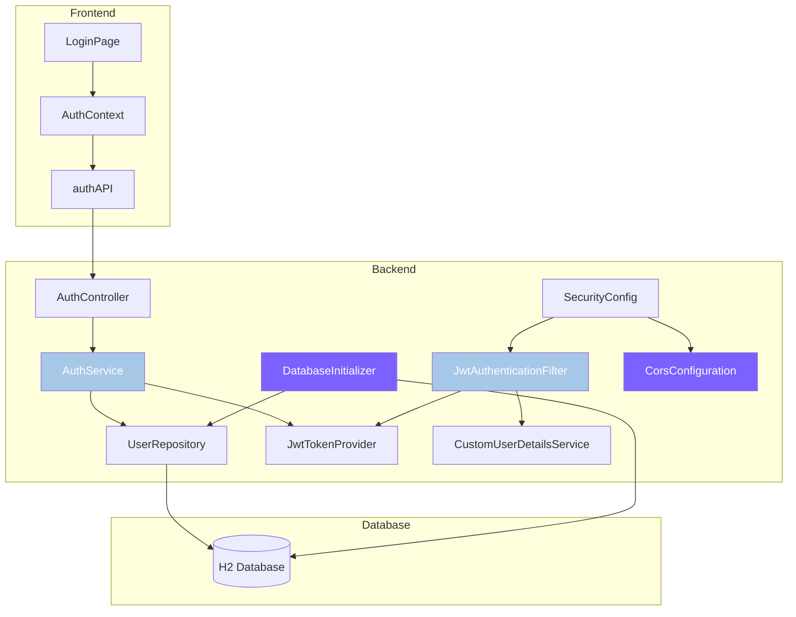

# Design Document: Authentication Fixes

## Overview

This design addresses critical authentication issues in the AI-BH application by implementing null safety annotations, database initialization with demo users, enhanced CORS configuration, improved error handling, and production-ready JWT configuration. The solution maintains the existing Spring Security architecture while adding robustness and developer-friendly features.

The design follows a layered approach:
1. **Security Layer**: Enhanced JWT filter with null safety
2. **Service Layer**: Improved error handling and validation in AuthService
3. **Data Layer**: Database initialization component for demo users
4. **Configuration Layer**: Enhanced CORS, JWT, and database settings
5. **Frontend Layer**: Better error display and user feedback

## Architecture

### Component Overview



### Data Flow

**Login Flow:**
1. User submits credentials via LoginPage
2. AuthContext calls authAPI.login()
3. Request hits AuthController with CORS headers
4. AuthService authenticates via AuthenticationManager
5. JWT tokens generated and returned
6. Frontend stores tokens and user data
7. Subsequent requests include JWT in Authorization header
8. JwtAuthenticationFilter validates token and sets SecurityContext

**Database Initialization Flow:**
1. Application starts
2. JPA creates schema (update mode)
3. DatabaseInitializer runs after schema creation
4. Checks if demo user exists
5. Creates demo user if missing
6. Logs initialization status

## Components and Interfaces

### 1. JwtAuthenticationFilter (Enhanced)

**Purpose**: Validate JWT tokens on incoming requests with proper null safety

**Changes**:
- Add @NonNull annotations to doFilterInternal parameters
- Import org.springframework.lang.NonNull
- Maintain existing functionality

**Interface**:
```java
@Override
protected void doFilterInternal(
    @NonNull HttpServletRequest request,
    @NonNull HttpServletResponse response,
    @NonNull FilterChain filterChain
) throws ServletException, IOException
```

### 2. AuthService (Enhanced)

**Purpose**: Handle authentication operations with improved error handling

**Changes**:
- Add explicit null checks before type conversions
- Return structured error responses with specific messages
- Add validation for account status
- Improve logging with appropriate levels

**Key Methods**:
```java
public AuthResponse login(AuthRequest request) throws AuthenticationException
public AuthResponse signup(SignupRequest request) throws ValidationException
public AuthResponse refreshToken(RefreshTokenRequest request) throws TokenException
```

**Error Handling Strategy**:
- Catch specific exceptions (BadCredentialsException, DisabledException)
- Map to appropriate HTTP status codes
- Return user-friendly error messages
- Log errors with context but without sensitive data

### 3. DatabaseInitializer (New Component)

**Purpose**: Initialize database with demo users and essential data

**Implementation**:
```java
@Component
public class DatabaseInitializer implements ApplicationRunner {
    
    @Autowired
    private UserRepository userRepository;
    
    @Autowired
    private PasswordEncoder passwordEncoder;
    
    @Override
    public void run(ApplicationArguments args) {
        initializeDemoUser();
    }
    
    private void initializeDemoUser() {
        // Check if demo user exists
        // Create if missing
        // Log status
    }
}
```

**Characteristics**:
- Implements ApplicationRunner for post-startup execution
- Idempotent (safe to run multiple times)
- Logs all operations
- Continues on errors (doesn't block startup)

### 4. GlobalExceptionHandler (New Component)

**Purpose**: Centralized exception handling for consistent error responses

**Implementation**:
```java
@RestControllerAdvice
public class GlobalExceptionHandler {
    
    @ExceptionHandler(BadCredentialsException.class)
    public ResponseEntity<ErrorResponse> handleBadCredentials(BadCredentialsException ex)
    
    @ExceptionHandler(DisabledException.class)
    public ResponseEntity<ErrorResponse> handleDisabledAccount(DisabledException ex)
    
    @ExceptionHandler(MethodArgumentNotValidException.class)
    public ResponseEntity<ErrorResponse> handleValidationErrors(MethodArgumentNotValidException ex)
    
    @ExceptionHandler(Exception.class)
    public ResponseEntity<ErrorResponse> handleGenericException(Exception ex)
}
```

**Error Response Structure**:
```java
public class ErrorResponse {
    private String message;
    private int status;
    private LocalDateTime timestamp;
    private Map<String, String> fieldErrors; // For validation errors
}
```

### 5. Enhanced CORS Configuration

**Purpose**: Properly configure CORS for frontend-backend communication

**Configuration**:
```java
@Bean
public CorsConfigurationSource corsConfigurationSource() {
    CorsConfiguration configuration = new CorsConfiguration();
    
    // Allow frontend origins
    configuration.setAllowedOriginPatterns(Arrays.asList(
        "http://localhost:*",
        "https://localhost:*"
    ));
    
    // Allow all HTTP methods
    configuration.setAllowedMethods(Arrays.asList(
        "GET", "POST", "PUT", "DELETE", "OPTIONS", "PATCH"
    ));
    
    // Allow all headers
    configuration.setAllowedHeaders(Arrays.asList("*"));
    
    // Expose authorization headers
    configuration.setExposedHeaders(Arrays.asList(
        "Authorization",
        "Content-Type"
    ));
    
    // Allow credentials
    configuration.setAllowCredentials(true);
    
    // Cache preflight for 1 hour
    configuration.setMaxAge(3600L);
    
    UrlBasedCorsConfigurationSource source = new UrlBasedCorsConfigurationSource();
    source.registerCorsConfiguration("/**", configuration);
    return source;
}
```

### 6. JWT Configuration Enhancement

**Purpose**: Secure JWT configuration with validation

**Implementation**:
```java
@Component
@ConfigurationProperties(prefix = "app.jwt")
public class JwtConfig {
    
    private String secret;
    private long expiration;
    private long refreshExpiration;
    
    @PostConstruct
    public void validateConfig() {
        // Check secret length
        // Warn if using default
        // Fail if production without custom secret
    }
    
    // Getters and setters
}
```

**Validation Rules**:
- Secret must be at least 256 bits (32 bytes)
- Warn in development if using default secret
- Fail in production if JWT_SECRET not set
- Log configuration status (without exposing secret)

### 7. Health Check Endpoint

**Purpose**: Provide system health status for monitoring

**Implementation**:
```java
@RestController
@RequestMapping("/aibh")
public class HealthController {
    
    @Autowired
    private UserRepository userRepository;
    
    @Autowired
    private JwtConfig jwtConfig;
    
    @GetMapping("/health")
    public ResponseEntity<HealthResponse> health() {
        // Check database connectivity
        // Check JWT configuration
        // Return status
    }
}
```

**Health Response**:
```java
public class HealthResponse {
    private String status; // UP, DOWN, DEGRADED
    private Map<String, String> checks;
    private LocalDateTime timestamp;
}
```

### 8. Frontend Error Handling Enhancement

**Purpose**: Display clear error messages to users

**Changes to AuthContext**:
```javascript
const login = async (email, password) => {
  try {
    const response = await authAPI.login(email, password);
    // ... success handling
    return { success: true };
  } catch (error) {
    // Extract error message from response
    const errorMessage = error.response?.data?.message 
      || error.message 
      || 'Login failed. Please try again.';
    
    return { 
      success: false, 
      error: errorMessage 
    };
  }
};
```

**Changes to LoginPage**:
- Display errors using toast notifications
- Add form validation before submission
- Clear errors on input change
- Show loading state during authentication

## Data Models

### ErrorResponse

```java
public class ErrorResponse {
    private String message;
    private int status;
    private LocalDateTime timestamp;
    private Map<String, String> fieldErrors;
    
    // Constructors
    public ErrorResponse(String message, int status) {
        this.message = message;
        this.status = status;
        this.timestamp = LocalDateTime.now();
    }
    
    // Getters and setters
}
```

### HealthResponse

```java
public class HealthResponse {
    private String status;
    private Map<String, String> checks;
    private LocalDateTime timestamp;
    
    public HealthResponse() {
        this.checks = new HashMap<>();
        this.timestamp = LocalDateTime.now();
    }
    
    public void addCheck(String name, String status) {
        this.checks.put(name, status);
    }
    
    // Getters and setters
}
```

### JwtConfig

```java
@Component
@ConfigurationProperties(prefix = "app.jwt")
public class JwtConfig {
    private String secret;
    private long expiration;
    private long refreshExpiration;
    
    // Validation and getters/setters
}
```

### Database Schema Changes

No schema changes required. The existing User entity supports all requirements.

## Correctness Properties

*A property is a characteristic or behavior that should hold true across all valid executions of a system—essentially, a formal statement about what the system should do. Properties serve as the bridge between human-readable specifications and machine-verifiable correctness guarantees.*


### Property 1: Database Initialization Idempotence

*For any* number of application restarts, running the database initializer multiple times should result in exactly one demo user with email "demo@aibh.com" existing in the database.

**Validates: Requirements 2.3**

### Property 2: Data Persistence Across Restarts

*For any* user data saved to the database before application restart, that data should exist and be unchanged after the application restarts.

**Validates: Requirements 3.3**

### Property 3: Validation Error Field Mapping

*For any* signup request with invalid fields, the error response should contain a field error entry for each invalid field with a descriptive message.

**Validates: Requirements 5.4**

### Property 4: Authentication Failure Status Codes

*For any* authentication failure (invalid credentials, disabled account, expired token), the HTTP response status code should be 401 Unauthorized.

**Validates: Requirements 5.6**

### Property 5: Validation Failure Status Codes

*For any* request with validation errors (missing required fields, invalid format, constraint violations), the HTTP response status code should be 400 Bad Request.

**Validates: Requirements 5.7**

### Property 6: Unexpected Error Status Codes

*For any* unhandled exception or unexpected server error during request processing, the HTTP response status code should be 500 Internal Server Error.

**Validates: Requirements 5.8**

### Property 7: Log Security - No Sensitive Data

*For any* log message generated by the authentication system, the message content should not contain passwords, JWT tokens, or refresh tokens.

**Validates: Requirements 6.6**

### Property 8: JWT Secret Minimum Length

*For any* JWT secret configured in the application (default or custom), the secret length should be at least 256 bits (32 bytes).

**Validates: Requirements 7.3**

### Property 9: Health Check Failure Response

*For any* health check where at least one component check fails (database, JWT config), the response should have HTTP status 503 and status field "DOWN".

**Validates: Requirements 10.5**

## Error Handling

### Error Categories

1. **Authentication Errors** (HTTP 401)
   - Invalid credentials
   - Expired tokens
   - Disabled accounts
   - Missing authentication

2. **Validation Errors** (HTTP 400)
   - Missing required fields
   - Invalid email format
   - Password too short
   - Duplicate email

3. **Authorization Errors** (HTTP 403)
   - Insufficient permissions
   - Access to restricted resources

4. **Server Errors** (HTTP 500)
   - Database connection failures
   - Unexpected exceptions
   - Configuration errors

### Error Response Format

All errors follow a consistent JSON structure:

```json
{
  "message": "Human-readable error message",
  "status": 400,
  "timestamp": "2024-01-15T10:30:00",
  "fieldErrors": {
    "email": "Email is required",
    "password": "Password must be at least 8 characters"
  }
}
```

### Exception Handling Strategy

**GlobalExceptionHandler** catches and transforms exceptions:

```java
@RestControllerAdvice
public class GlobalExceptionHandler {
    
    private static final Logger logger = LoggerFactory.getLogger(GlobalExceptionHandler.class);
    
    @ExceptionHandler(BadCredentialsException.class)
    public ResponseEntity<ErrorResponse> handleBadCredentials(BadCredentialsException ex) {
        logger.warn("Authentication failed: Invalid credentials");
        ErrorResponse error = new ErrorResponse("Invalid email or password", 401);
        return ResponseEntity.status(401).body(error);
    }
    
    @ExceptionHandler(DisabledException.class)
    public ResponseEntity<ErrorResponse> handleDisabledAccount(DisabledException ex) {
        logger.warn("Authentication failed: Account disabled");
        ErrorResponse error = new ErrorResponse("Account is disabled", 401);
        return ResponseEntity.status(401).body(error);
    }
    
    @ExceptionHandler(MethodArgumentNotValidException.class)
    public ResponseEntity<ErrorResponse> handleValidationErrors(MethodArgumentNotValidException ex) {
        ErrorResponse error = new ErrorResponse("Validation failed", 400);
        
        ex.getBindingResult().getFieldErrors().forEach(fieldError -> {
            error.addFieldError(fieldError.getField(), fieldError.getDefaultMessage());
        });
        
        logger.warn("Validation failed: {}", error.getFieldErrors());
        return ResponseEntity.status(400).body(error);
    }
    
    @ExceptionHandler(DataIntegrityViolationException.class)
    public ResponseEntity<ErrorResponse> handleDataIntegrityViolation(DataIntegrityViolationException ex) {
        logger.error("Data integrity violation", ex);
        
        String message = "Email already exists";
        if (ex.getMessage().contains("email")) {
            message = "Email already exists";
        }
        
        ErrorResponse error = new ErrorResponse(message, 400);
        return ResponseEntity.status(400).body(error);
    }
    
    @ExceptionHandler(Exception.class)
    public ResponseEntity<ErrorResponse> handleGenericException(Exception ex) {
        logger.error("Unexpected error occurred", ex);
        ErrorResponse error = new ErrorResponse("An unexpected error occurred", 500);
        return ResponseEntity.status(500).body(error);
    }
}
```

### Frontend Error Handling

**AuthContext Error Extraction**:
```javascript
const extractErrorMessage = (error) => {
  // API error response
  if (error.response?.data?.message) {
    return error.response.data.message;
  }
  
  // Network error
  if (error.message === 'Network Error') {
    return 'Unable to connect to server. Please try again.';
  }
  
  // Timeout error
  if (error.code === 'ECONNABORTED') {
    return 'Request timed out. Please try again.';
  }
  
  // Generic error
  return error.message || 'An unexpected error occurred';
};
```

**LoginPage Error Display**:
```javascript
const handleSubmit = async (e) => {
  e.preventDefault();
  
  // Client-side validation
  if (!formData.email || !formData.password) {
    toast.error('Please fill in all fields');
    return;
  }
  
  setLoading(true);
  
  try {
    const result = await login(formData.email, formData.password);
    
    if (result.success) {
      toast.success('Welcome back!');
      navigate(from, { replace: true });
    } else {
      toast.error(result.error);
    }
  } catch (error) {
    toast.error('Something went wrong. Please try again.');
  } finally {
    setLoading(false);
  }
};
```

### Logging Strategy

**Log Levels**:
- **INFO**: Successful operations (login, signup, initialization)
- **WARN**: Failed operations (invalid credentials, validation errors)
- **ERROR**: Unexpected errors (exceptions, system failures)

**Log Format**:
```
2024-01-15 10:30:00 [http-nio-8080-exec-1] INFO  c.a.service.AuthService - Login successful for user: user@example.com
2024-01-15 10:30:05 [http-nio-8080-exec-2] WARN  c.a.service.AuthService - Login failed for user: wrong@example.com - Invalid credentials
2024-01-15 10:30:10 [http-nio-8080-exec-3] ERROR c.a.service.AuthService - Unexpected error during signup - java.sql.SQLException
```

**Security Considerations**:
- Never log passwords (plain or hashed)
- Never log JWT tokens or refresh tokens
- Log user emails for audit trail
- Log IP addresses for rate limiting
- Sanitize user input before logging

## Testing Strategy

### Dual Testing Approach

The authentication fixes will be validated using both unit tests and property-based tests:

**Unit Tests**: Verify specific examples, edge cases, and error conditions
- Specific error messages for different failure scenarios
- Demo user creation on first startup
- CORS headers for specific origins
- Health check endpoint responses
- Configuration validation with specific invalid values

**Property Tests**: Verify universal properties across all inputs
- Database initialization idempotence (run N times, same result)
- Data persistence across restarts (any data saved persists)
- Error status codes (all auth failures → 401, all validation → 400)
- Log security (no logs contain passwords/tokens)
- JWT secret length (all secrets >= 32 bytes)

### Property-Based Testing Configuration

**Library**: Use JUnit 5 with jqwik for Java property-based testing

**Configuration**:
- Minimum 100 iterations per property test
- Each test tagged with feature name and property number
- Tag format: `@Tag("Feature: authentication-fixes, Property N: [property text]")`

**Example Property Test**:
```java
@Property
@Tag("Feature: authentication-fixes, Property 1: Database Initialization Idempotence")
void databaseInitializationIsIdempotent(@ForAll @IntRange(min = 1, max = 10) int restartCount) {
    // Run initializer N times
    for (int i = 0; i < restartCount; i++) {
        databaseInitializer.run(null);
    }
    
    // Verify exactly one demo user exists
    List<User> demoUsers = userRepository.findByEmail("demo@aibh.com");
    assertThat(demoUsers).hasSize(1);
}
```

### Test Coverage Requirements

**Backend Unit Tests**:
- JwtAuthenticationFilter: Null safety annotations compile without warnings
- AuthService: All error scenarios return correct messages and status codes
- DatabaseInitializer: Demo user creation and idempotence
- GlobalExceptionHandler: All exception types mapped correctly
- SecurityConfig: CORS configuration allows required origins and headers
- JwtConfig: Validation logic for secret length and production mode
- HealthController: All health check scenarios

**Backend Property Tests**:
- Property 1: Database initialization idempotence
- Property 2: Data persistence across restarts
- Property 3: Validation error field mapping
- Property 4: Authentication failure status codes
- Property 5: Validation failure status codes
- Property 6: Unexpected error status codes
- Property 7: Log security (no sensitive data)
- Property 8: JWT secret minimum length
- Property 9: Health check failure response

**Frontend Unit Tests**:
- AuthContext: Error message extraction from various error types
- LoginPage: Form validation before API calls
- LoginPage: Error display using toast notifications
- LoginPage: Demo credentials display

**Integration Tests**:
- End-to-end login flow with demo user
- CORS preflight requests from frontend origin
- Token refresh flow
- Health check endpoint accessibility

### Test Execution

**Backend Tests**:
```bash
# Run all tests
./mvnw test

# Run only unit tests
./mvnw test -Dgroups="unit"

# Run only property tests
./mvnw test -Dgroups="property"

# Run with coverage
./mvnw test jacoco:report
```

**Frontend Tests**:
```bash
# Run all tests
npm test

# Run with coverage
npm test -- --coverage
```

## Implementation Notes

### Null Safety Annotations

**Import Statement**:
```java
import org.springframework.lang.NonNull;
```

**Application**:
- Add to all method parameters that override framework methods
- Add to return types where appropriate
- Use consistently across all security components

### Database Configuration Changes

**application.properties**:
```properties
# Change from in-memory to file-based
spring.datasource.url=jdbc:h2:file:./data/aibh_dev

# Change from create-drop to update
spring.jpa.hibernate.ddl-auto=update
```

### JWT Secret Generation

**Development Mode**:
```java
private String generateSecureSecret() {
    SecureRandom random = new SecureRandom();
    byte[] bytes = new byte[32]; // 256 bits
    random.nextBytes(bytes);
    return Base64.getEncoder().encodeToString(bytes);
}
```

**Production Mode**:
- Require JWT_SECRET environment variable
- Fail startup if not provided
- Validate length >= 32 bytes

### CORS Configuration

**Key Points**:
- Use `setAllowedOriginPatterns` instead of `setAllowedOrigins` for wildcard support
- Set `maxAge` to cache preflight responses
- Expose Authorization header for frontend access
- Allow credentials for cookie-based auth (if needed)

### Health Check Implementation

**Database Check**:
```java
private boolean checkDatabase() {
    try {
        userRepository.count();
        return true;
    } catch (Exception e) {
        logger.error("Database health check failed", e);
        return false;
    }
}
```

**JWT Config Check**:
```java
private boolean checkJwtConfig() {
    return jwtConfig.getSecret() != null 
        && jwtConfig.getSecret().length() >= 32;
}
```

## Security Considerations

1. **Password Storage**: Continue using BCrypt with default strength (10 rounds)
2. **JWT Secrets**: Minimum 256 bits, rotated periodically in production
3. **Token Expiration**: Access tokens 24 hours, refresh tokens 7 days
4. **Rate Limiting**: Existing RateLimitFilter continues to protect endpoints
5. **CORS**: Restrict to known origins in production
6. **Logging**: Never log sensitive data (passwords, tokens)
7. **Error Messages**: Generic messages for security (don't reveal if email exists)
8. **HTTPS**: Enforce in production (not part of this spec)

## Performance Considerations

1. **Database Initialization**: Runs once on startup, minimal impact
2. **CORS Preflight Caching**: 1-hour cache reduces OPTIONS requests
3. **Health Check**: Lightweight checks, suitable for frequent polling
4. **Error Handling**: Minimal overhead, only on error paths
5. **Logging**: Async logging recommended for production

## Deployment Considerations

### Environment Variables

**Required in Production**:
- `JWT_SECRET`: Custom secret, minimum 32 bytes
- `SPRING_PROFILES_ACTIVE`: Set to "prod"

**Optional**:
- `JWT_EXPIRATION`: Override default 24 hours
- `JWT_REFRESH_EXPIRATION`: Override default 7 days

### Database Migration

**Development to Production**:
1. Export H2 data if needed
2. Switch to PostgreSQL/MySQL in production
3. Update datasource configuration
4. Run database initializer on first production startup

### Monitoring

**Health Check Integration**:
- Configure load balancer to poll /api/aibh/health
- Set up alerts for DOWN status
- Monitor response times

**Logging Integration**:
- Configure log aggregation (ELK, Splunk)
- Set up alerts for ERROR level logs
- Monitor authentication failure rates

## Future Enhancements

1. **Token Blacklisting**: Implement Redis-based token blacklist for logout
2. **Multi-Factor Authentication**: Add MFA support
3. **Password Reset**: Implement forgot password flow
4. **Email Verification**: Verify email addresses on signup
5. **OAuth Integration**: Add social login (Google, GitHub)
6. **Audit Logging**: Comprehensive audit trail for security events
7. **Account Lockout**: Lock accounts after N failed login attempts
8. **Session Management**: Track active sessions per user
